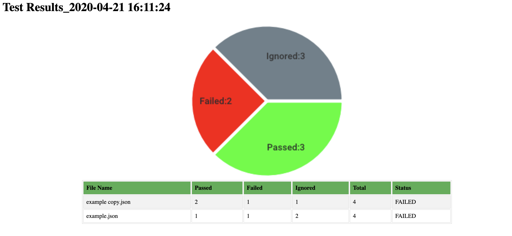

[](https://goreportcard.com/report/github.com/kotanetes/go-test-it)

# go-test-it
Automated regression testing package written in Go.This tool supports both REST API and GraphQL API. All you need to do is write json files with all the possible scenarios. examples are available in /tests directory.

Installation instructions are listed below.

## Pre-Requsite
  Required go(>1.11) installed on machine.
   * if you are using MAC or Linux, make sure go/bin is added to PATH
 
## Installation
   ```bash
   go get github.com/kotanetes/go-test-it
   ```
## Usage
  * Create a JSON file similar to example file in /test/example.json in any directory
  * Can't creating JSON files? Tool will create sample file and couple of test sceanrios
      ```bash
      go-test-it init #generates json file with test scenarios
      ```
  * Need help?
  ```bash
  go-test-it -help
  ```
  * Create a direcotry and add json file, which have all the test scenarios refer to file in /test/example.json
  * By Default, `go-test-it` will read all .json files in the current directory and run the tests
     ```bash
      go-test-it
      ```
  * Tool has the ability to run tests in a specific file.
      ```bash
      go-test-it -file-path=./rest_services -file-name=service1.json
      ```     
  * Ignore Test Scenario
    * Add indicator `"ignore":true` to the test scenario and tool will skip the test scenario
    
 ## Results
  * Tool generates results as a HTMl Report,Pie Chart and also prints the results to console
    
    
    
   * Tool also generate the JSON Results of all scenarios per file, So that User can go through errors
     examples are available [here](./regression/file_results/)
     * [Ignored Results](./regression/file_results/result_go_test_it_reg_1.json#L4)
     * [Passed Results](./regression/file_results/result_go_test_it_reg_1.json#L7)
     * [Failed Results](./regression/file_results/result_go_test_it_reg_1.json#L56)
     * [Errors](./regression/file_results/result_go_test_it_reg_1.json#L63)
  
